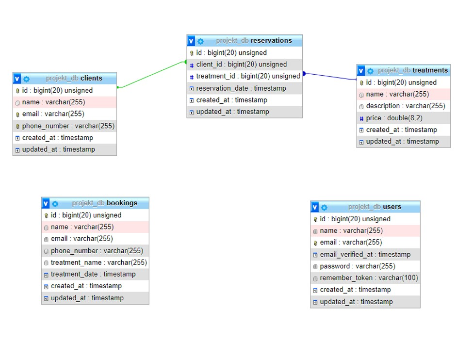

# SpaCrudApp
A simple CRUD application I made for my University Class. I used Laravel framework to create this app.
## Topic
The project's topic is to create an application for managing a spa treatment reservation system. The "guest" of the application, meaning the non-logged-in user, can send a query about booking a treatment and view the application's homepage. On the other hand, a logged-in user can manage all the resources of the application, such as customers, reservations, treatments, and booking inquiries. When a logged-in user sees a "request" for a reservation, they can contact the person who sent the inquiry via email or phone. After consulting with the responsible person, they can add a treatment reservation for the customer who sent the inquiry.
## Database

### Database tables description
+ clients - it contains data of clients who are or have used SPA services.
+ treatments - a list of treatments available for clients.
+ bookings - a table with booking inquiries sent by non-logged-in users.
+ users - a table containing data of users who can log in to manage application resources.
